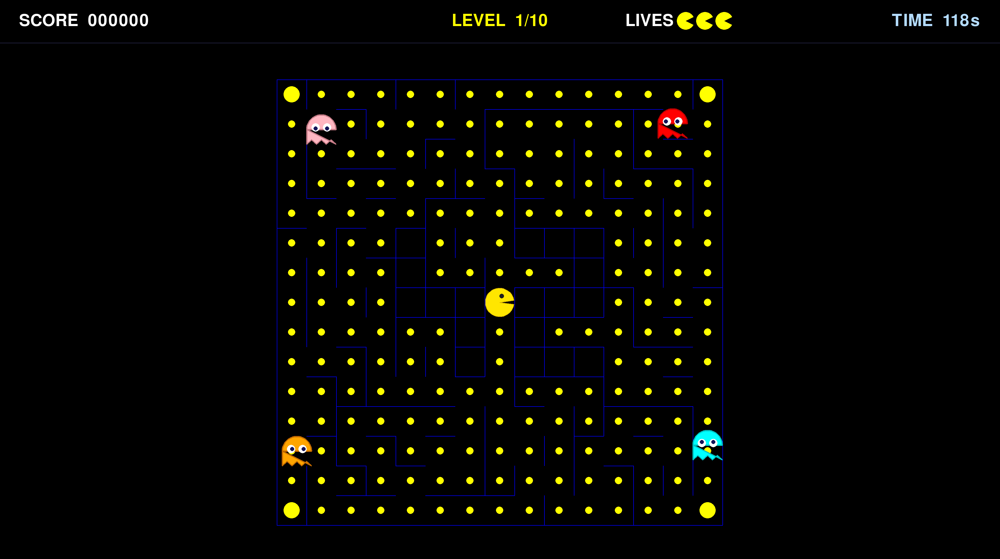

# 👾 Pac-Man



> A modern Python remake of the classic arcade game — mazes, ghosts, and glory.

Built with `pygame` and a clean OOP architecture. Navigate procedurally generated mazes, eat pacgums, dodge four ghosts, and chase the top-10 highscore.

---

## ✨ Features

- Procedurally generated mazes via the *A-Maze-ing* package
- Four ghosts with individual AI: Blinky, Pinky, Inky & Clyde
- JSON config file (with `#` comment support) for levels and scoring rules
- Persistent top-10 highscore system
- Full UI: main menu, instructions, highscores, pause, game-over & victory screens
- Cheat mode for peer review
- Robust error handling — bad config values are clamped, never crash

---

## 🚀 Quick Start

```sh
make install   # Install dependencies
make run       # Launch with default config.json
```

Custom config:
```sh
make run CONFIG=foo.json
# or
python3 pac_man.py config.json
```

---

## 🎮 Controls

| Key | Action |
|-----|--------|
| Arrow keys / WASD | Move Pac-Man |
| `ESC` | Pause / resume |
| `ENTER` | Confirm selection or save score |
| `BACKSPACE` | Delete character when typing name |

**Cheat mode** (activate from pause menu → CHEAT → ENTER):

| Key | Action |
|-----|--------|
| `SPACE` | Skip current level |
| `+` / `=` | Add one life |
| `-` | Remove one life |

> When active: Pac-Man is invincible and moves at double speed.

---

## ⚙️ Configuration

JSON with `#` line-comment support:

```json
{
    "highscore_filename": "highscores.json",
    "seed": 42,
    "lives": 3,
    "points_per_pacgum": 10,
    "points_per_super_pacgum": 50,
    "points_per_ghost": 200,
    "levels": [
        { "level_id": 1, "width": 20, "height": 20, "pacgum": 40, "level_max_time": 90 }
    ]
}
```

| Key | Type | Default | Notes |
|-----|------|---------|-------|
| `highscore_filename` | string | `highscores.json` | Path to top-10 highscore file |
| `seed` | int ≥ 0 | `42` | Seed for the first level |
| `lives` | int ≥ 1 | `3` | Starting lives |
| `points_per_pacgum` | int ≥ 0 | `10` | Points per pacgum |
| `points_per_super_pacgum` | int ≥ 0 | `50` | Points per super-pacgum |
| `points_per_ghost` | int ≥ 0 | `200` | Points per ghost (escape mode) |
| `levels` | array | required | List of `LevelConfig` objects |

**LevelConfig keys:** `level_id`, `width` [8–40], `height` [8–40], `pacgum` (≥1), `level_max_time` in seconds (≥1). Missing keys use defaults; invalid values are clamped with a `[CONFIG WARNING]`.

---

## 🏗️ Architecture

```
pac_man.py
└── GameMannager
    ├── Menu / HighScoreScene / Instructions
    ├── GameRun
    │   └── EntitiesMannager
    │       ├── Items (pacgums, super-pacgums, respawn)
    │       ├── Player
    │       └── GhostMannager (Blinky, Pinky, Inky, Clyde)
    └── GameOver
```

Every screen inherits from `BaseScene` and communicates via `(signal, value)` tuples. Config is validated by `pydantic` models in `src/parse/models.py`.

---

## 🛠️ Makefile Targets

| Target | Purpose |
|--------|---------|
| `install` | Install dependencies |
| `run` | Launch the game |
| `debug` | Launch inside `pdb` |
| `clean` | Remove caches and build artifacts |
| `lint` | Run `flake8` + `mypy` |
| `lint-strict` | Run `flake8` + `mypy --strict` |

---

## 📚 Resources

- [Pac-Man dossier](https://pacman.com/) — canonical ghost AI reference
- [pygame docs](https://www.pygame.org/docs/)
- [pydantic v2 docs](https://docs.pydantic.dev/)

---
